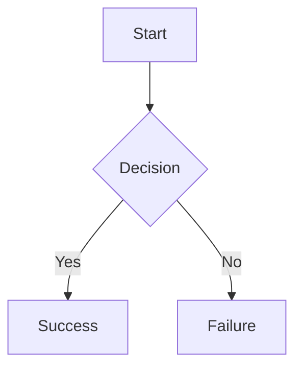

# Markdown to Word Converter

A standalone executable tool that converts Markdown files to professionally formatted Word documents (.docx).

## Features

- **Drag & Drop Support**: Simply drag a .md file onto the executable
- **File Picker Dialog**: Double-click the executable to select a file
- **Professional Formatting**:
  - Headings mapped to Word styles
  - Bold and italic formatting preserved
  - Tables converted to Word tables
  - LaTeX equations as Word equation objects
  - **Mermaid diagrams automatically rendered as images**
  - Images with captions
  - Bullet and numbered lists
- **No Installation Required**: Standalone executable with all dependencies bundled
- **Lightweight**: ~15-20MB executable (no browser dependencies)

## Usage

### Method 1: Drag & Drop
1. Drag any `.md` file onto the `MarkdownToWord.exe` icon
2. The `.docx` file is created in the same folder with the same name

### Method 2: File Picker
1. Double-click `MarkdownToWord.exe`
2. Select your `.md` file from the file picker dialog
3. The `.docx` is created in the same folder

### Method 3: Command Line
```bash
MarkdownToWord.exe input_file.md
# Or with custom output name:
MarkdownToWord.exe input_file.md -o custom_output.docx
```

## Download

Download the latest Windows executable from the [Releases](../../releases) page.

## Building from Source

### Windows
```bash
pip install -r requirements.txt
pip install pyinstaller
pyinstaller --onefile --name "MarkdownToWord" markdown_to_word.py
```

The executable will be in the `dist/` folder.

### macOS/Linux
```bash
pip install -r requirements.txt
pip install pyinstaller
pyinstaller --onefile --name "MarkdownToWord" markdown_to_word.py
```

Note: This creates a macOS/Linux executable, not a Windows .exe

## Supported Markdown Features

- Headings (# through ######)
- Bold (**text**)
- Italic (*text*)
- Tables (GitHub-flavored markdown)
- Inline LaTeX equations ($equation$)
- Display LaTeX equations ($$equation$$)
- **Mermaid diagrams** (```mermaid ... ```) - Rendered as PNG images
- Images ()
- Bullet lists (-, *, +)
- Numbered lists (1., 2., etc.)

## Mermaid Diagram Support

Mermaid diagrams are automatically rendered using the official mermaid.ink API service. All diagram types are supported:

- Flowcharts (`graph TD`, `graph LR`)
- Sequence diagrams (`sequenceDiagram`)
- Class diagrams (`classDiagram`)
- State diagrams (`stateDiagram`)
- Entity Relationship diagrams (`erDiagram`)
- Gantt charts (`gantt`)
- Pie charts (`pie`)
- And more!

**Example:**
````markdown

````

**Quality & Rendering:**
- **Best quality:** True 4K resolution PNG images (20x scale, ~4000+ pixels width, ~650-700 DPI)
  - Requires Playwright browser (Chromium) to be installed
  - Automatically falls back to standard quality if browser unavailable
- **Standard quality:** Direct PNG from API (~784 pixels width, ~126 DPI)
  - Used as fallback when Playwright/browser not available
  - Still provides good quality for most use cases
- Automatically sized to fit page (max 75% of A4 dimensions: 6.2" × 8.77")
- Maintains aspect ratio while respecting both width and height constraints
- Intelligent fallback ensures diagrams always render

**Note:** Requires internet connection to render diagrams via mermaid.ink API.

## Document Formatting

- Font: Calibri 11pt
- Margins: 0.98" all sides
- Line spacing: 1.08
- Paragraph alignment: Justified
- Headings: Word built-in styles

## License

MIT License - Feel free to use and modify
